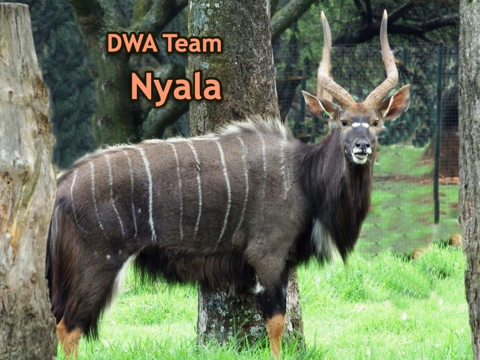

# Projectgroep Nyala

### Introductie 
Xtend wilt graag een webapplicatie hebben waarin de beheerder mailtemplates kan opstellen, deze opslaan voor later gebruik en eventueel aanpassen. Er moet een mogelijkheid komen voor klanten/studenten van Xtend om zich d.m.v. een QR code of een linkje zich in te schrijven op een bepaalde maillijst en vervolgens mailtjes te ontvangen. Het zou ook een mogelijkheid moeten zijn voor de beheerder om handmatig mensen toe te voegen, daarnaast moet het voor de klanten/studenten mogelijk zijn om zich ook weer uit te schrijven van de maillijsten. Ook moeten mailtjes ingepland kunnen worden zodat ze op een later moment worden verstuurd. Xtend zou verder graag de mogelijkheid willen hebben om statestieken in te kunnen zien van de gestuurde mailtjes, denk hier bijvoorbeeld aan hoe vaak mailtjes geopend zijn, hoeveel mensen zich afmelden van de maillijst aan hand van bepaalde mails. Dit alles moet overzichtelijk in een admin-panel staan zodat de beheerder gemakkelijk templates kan maken en versturen.

### Hoe gebruikt men onze code
Hier komt te staan hoe men de Docker voor het eerst opzet en daarna aan/uit zet.

### Hoe gebruik je als developer onze code
Uitleg invoegen wanneer dit van toepassing is. (Bijv. een begin maken aan het einde van de sprint, wanneer alle tests af zijn.)
Hier kan bijv. komen hoe belangrijke variablen aan kunnen worden gepast, zoals admin naam.

### Contact voor hulp of om bugs aan te geven
projectgroep-nyala@hotmail.com

#### Contactgegevens opdrachtgever
Robert Boudewijn
- r.boudewijn@svxtend.nl

#### Groepsgenoten
 - Richard Visser, 1677755, HJ.Visser@student.han.nl
 - Mark Evers, 2110802, MDA.Evers@student.han.nl
 - Matthias Budding, 2368952, MD.Budding@student.han.nl
 - Jules Koster, 1653865, JFJ.Koster@student.han.nl
 
### Links naar andere documenten
[Software guidebook](https://github.com/HANICA-DWA/project-sep23-nyala/blob/main/groepsdocumenten/Software%20Guidebook.md) 
[Algemene documentatie van de opdracht](https://github.com/HANICA-DWA/project-sep23-nyala/tree/main/groepsdocumenten/Template-projectplan-dwa)
