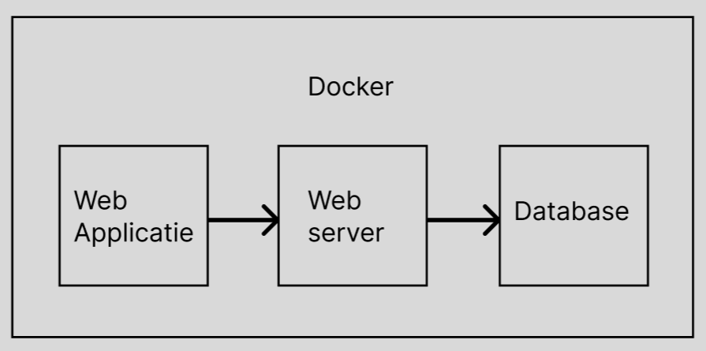

> Voor nu, tijdens de eerste twee sprints, loopt de software nog lokaal. Er is wel al een idee voor Docker die hier ook zal worden beschreven, maar hoe een uiteindelijke deployment server in elkaar zal zitten is nog niet bekend en zal ook pas in de laatste sprint worden beschreven. Er worden wel wat algemene ideeen over een server opgenoemd, maar het gaat nog niet in de diepte.

De applicatie zal worden uitgevoerd in een Docker-container. Momenteel wordt hiervoor gebruik gemaakt van Docker Desktop, dat lokaal op de computer van de ontwikkelaar draait. De containers worden gebouwd met de standaard Docker daemon-configuratie. De containers bestaan uit een webapplicatie, een webserver en een database, die onderling kunnen communiceren. Wanneer de applicatie voor het eerst wordt ingezet, moet de opdracht "docker-compose up --build" worden gebruikt om de Docker-images te genereren. Bij latere starts van de applicatie gebruikt men "docker-compose up", maar als er wijzigingen worden aangebracht in de Docker-configuratie (docker-compose.yml, Dockerfile.frontend, Dockerfile.backend, Dockerfile.database), is de oorspronkelijke opdracht weer nodig om de Docker-images aan te passen. Uiteindelijk zal de Docker-omgeving draaien op een server geleverd door Xtend. De volledige omgeving, dus alle drie de containers, zal op dezelfde server draaien. Als de webserver- of databasecontainer uitvalt, blijft de webapplicatie actief. Als de server waarop alles draait defect raakt, gaat alle data verloren. Dit vormt geen probleem voor de code, omdat deze van Github kan worden gehaald. Na het uitvoeren van het startcommando zal alles weer draaien. Wat wel gebeurt, is dat alle data uit de database verloren gaat, omdat we geen back-upservice aanbieden. Het is echter onze aanbeveling dat er tijdens daadwerkelijk gebruik een back-upsysteem wordt geïmplementeerd, zodat in geval van nood de data snel kan worden overgezet naar een andere server en de applicatie zo snel mogelijk met de bestaande data draait. De toegewezen CPU- en geheugencapaciteiten zijn nog niet bepaald. Dit zal worden gedaan wanneer de Docker-omgeving volledig draait en is getest. Als er een fout optreedt op de implementatieserver en er moet worden teruggekeerd naar een eerdere versie van de code, kan de gewenste versie van Github worden gehaald, de oorspronkelijke opdracht worden uitgevoerd, en zal de applicatie weer werken. Vanuit ons wordt ook geen gegevensreplicatie geleverd.

