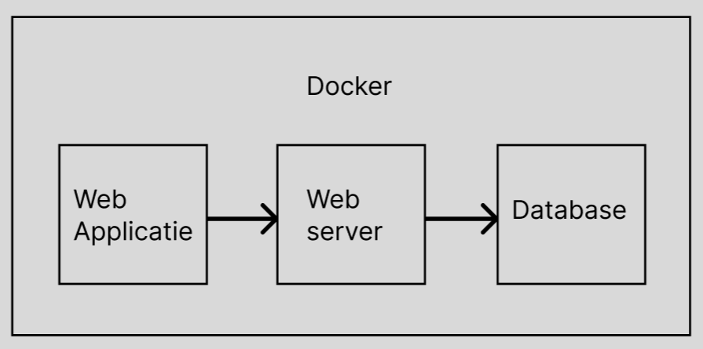

# Termen en karakterisering

| Term              | Uitleg                                                                           |
|-------------------|----------------------------------------------------------------------------------|
| Mail Editor       | Het gedeelte van de applicatie waar gebruikers e-mailsjablonen kunnen maken en opslaan.|
| Mail Lijsten      | Verzamelingen van e-mailadressen die geabonneerd zijn op specifieke onderwerpen of categorieën.|
| Templates         | Opgeslagen e-mailsjablonen die worden opgelsagen met een titel en kunnen worden bewerkt.|
| Geplande Emails   | E-mails die door de gebruiker zijn ingepland om op een later tijdstip te worden verstuurd.|
| Gebruiker         | Xtend beheerder die de applicatie gebruiken en beheren, inclusief het maken en versturen van e-mails.|
| Subscribers       | Personen die geabonneerd zijn op maillijsten, zich hebben aangemeld en e-mails ontvangen die door de gebruiker zijn verstuurd.|

# Context

Deze softwareopdracht betreft de ontwikkeling van een mailservice waarmee e-mailtemplates kunnen worden gemaakt en opgeslagen. Het hoofddoel is het versturen van deze templates naar subscribers die zich hebben ingeschreven voor specifieke maillijsten. De maillijsten moeten worden gekoppeld aan de subscribers, zodat automatisch de juiste e-mails naar de relevante doelgroep worden verzonden.

Gebruikers van dit product moeten in staat zijn eenvoudig e-mailtemplates te maken en op te slaan met behulp van een geïntegreerde e-maileditor. Bovendien moeten ze de mogelijkheid hebben om e-mails vooruit te plannen, zodat campagnes op een gepland tijdstip kunnen worden gelanceerd. Het overzicht van alle subscribers en maillijsten is cruciaal, aangezien gebruikers individuele aanpassingen willen maken en handmatig subscribers willen toevoegen.

Daarnaast is er behoefte aan een analysepaneel waarmee gebruikers de prestaties van hun e-mailcampagnes kunnen evalueren en verbeteringen kunnen identificeren. Deze analysetool moet inzichten bieden in zaken als open rates, klikfrequenties en andere relevante statistieken.

Tot slot moeten subscribers in staat zijn zich aan of af te melden voor maillijsten via een specifieke link, waardoor het beheer van de subscribers gestroomlijnd wordt.

Deze software zal worden gebruikt door Xtend gebruikers die verantwoordelijk zijn voor het opzetten en beheren van e-mailcampagnes binnen hun organisaties. Het is een vernieuwd marketingproces en systeem voor een efficiëntere uitvoering van e-mailmarketingactiviteiten.

## context diagram

 
 
Een contextdiagram biedt in één oogopslag een overzicht van hoe de applicatie wordt gebruikt en door welke personen. 

Hier wordt duidelijk dat er twee belanghebbenden zijn in de applicatie. De gebruiker fungeert als beheerder en heeft de bevoegdheid voor CRUD-acties. Aan de andere kant maakt de subscriber beperkt gebruik van de applicatie, alleen wanneer hij zich wil aan- of afmelden. Onze applicatie maakt gebruik van een extern systeem voor het bewerken van e-mails.

# Software Architecture

Hieronder vind je de software architecture van onze applicatie. De software architecture bestaat uit een component diagram en een container diagram. In het component diagram wordt de structuur van de applicatie weergegeven. In het container diagram wordt de architectuur van de applicatie weergegeven. De componenten en containers worden hieronder uitgelegd.

## Container diagram

  
  

  

  Het diagram hierboven toont de aanwezige containers binnen onze applicatie en de aanwezige gebruikers die we voor deze applicatie hebben gevonden. We hebben een gebruiker en subscriber die via HTTP verbinding maken met de webapplicatie die op zijn beurt via HTTP communiceert met de externe email editor die gebruikt wordt. Het process van de webapplicatie wordt hier op het hoogste niveau weergegeven.
  
  <b>Dit diagram bestaat uit drie containers die hier onder uitgelegd worden.</b>
  
  Allereerst heb je de webapplicatie, deze draait met React en Next.js en is verantwoordelijk voor het renderen van de pagina's en het afhandelen van de requests. De webapplicatie communiceert met de email editor via een HTTP verbinding. De email editor is een externe applicatie die gebruikt wordt om de email templates te maken. De email editor wordt op de webpagina geladen d.m.v. een Iframe en communiceerd met de webapplicatie via een HTTP verbinding. De webapplicatie communiceert vervolgens ook met de webserver en stuurt alle gegevens door naar de webserver. 
  
  De webserver is verantwoordelijk voor het opslaan van de gegevens in de database en het ophalen van de gegevens uit de database. De webserver draait op Node.js en Express en communiceert met de MongoDB database via een HTTP verbinding. 

  De MongoDB database is verantwoordelijk voor het opslaan van de gegevens die de webserver doorstuurt. De MongoDB database draait op MongoDB.

  Dit is de basis van onze applicatie. De webapplicatie is verantwoordelijk voor het renderen van de pagina's en het afhandelen van de requests. De webserver is verantwoordelijk voor het opslaan van de gegevens in de database en het ophalen van de gegevens uit de database. De MongoDB database is verantwoordelijk voor het opslaan van de gegevens die de webserver doorstuurt.

  

## Component diagram

  
  

  

  Het diagram hierboven toont alle componenten die aanwezig zijn binnen onze applicatie. De componenten zijn hieronder uitgelegd.

  <b>Dit diagram bestaat uit meerdere componenten die hier onder uitgelegd worden.</b>

  Om te beginnen maken we onderscheid tussen de componenten voor de subscriber en de componenten voor de gebruiker (Xtend). Voor de subscriber bestaat het component Unsubscribe via deze component kan de subscriber zich uitschrijven voor bepaalde emails. 

  De gebruiker (Xtend) heeft meer componenten, om te beginnen bij de Admin Panel. Via de admin panel heeft de gebruiker toegang tot alle andere componenten die nodig zijn om de applicatie te gebruiken. De gebruiker kan naar de Calender gaan om geplande emails in te zien en waar nodig aan te passen. Ook kan hij naar de Subscribers component gaan om een overzicht te zien van alle subscribers en waar nodig aan te passen. De gebruiker kan ook naar de Email component gaan om een overzicht te zien van alle maillijsten en de subscribers die zich hebben aangemeld voor die lijst. 

  Voor de rest hebben we ook de Layout component, deze word hergebruikt voor iedere pagina en is verantwoordelijk voor de header en footer. Ook is er een alert component die gebruikt wordt om de gebruiker te informeren over bepaalde acties. Zodat we niet voor iedere pagina een eigen alert te hoeven maken, op deze manier kunnen we de code schoon houden.
  

# Deployment

> Voor nu, tijdens de eerste twee sprints, loopt de software nog lokaal. Er is wel al een idee voor Docker die hier ook zal worden beschreven, maar hoe een uiteindelijke deployment server in elkaar zal zitten is nog niet bekend en zal ook pas in de laatste sprint worden beschreven. Er worden wel wat algemene ideeen over een server opgenoemd, maar het gaat nog niet in de diepte.

De applicatie zal worden uitgevoerd in een Docker-container. Momenteel wordt hiervoor gebruik gemaakt van Docker Desktop, dat lokaal op de computer van de ontwikkelaar draait. De containers worden gebouwd met de standaard Docker daemon-configuratie. De containers bestaan uit een webapplicatie, een webserver en een database, die onderling kunnen communiceren. Wanneer de applicatie voor het eerst wordt ingezet, moet de opdracht "docker-compose up --build" worden gebruikt om de Docker-images te genereren. Bij latere starts van de applicatie gebruikt men "docker-compose up", maar als er wijzigingen worden aangebracht in de Docker-configuratie (docker-compose.yml, Dockerfile.frontend, Dockerfile.backend, Dockerfile.database), is de oorspronkelijke opdracht weer nodig om de Docker-images aan te passen. Uiteindelijk zal de Docker-omgeving draaien op een server geleverd door Xtend. De volledige omgeving, dus alle drie de containers, zal op dezelfde server draaien. Als de webserver- of databasecontainer uitvalt, blijft de webapplicatie actief. Als de server waarop alles draait defect raakt, gaat alle data verloren. Dit vormt geen probleem voor de code, omdat deze van Github kan worden gehaald. Na het uitvoeren van het startcommando zal alles weer draaien. Wat wel gebeurt, is dat alle data uit de database verloren gaat, omdat we geen back-upservice aanbieden. Het is echter onze aanbeveling dat er tijdens daadwerkelijk gebruik een back-upsysteem wordt geïmplementeerd, zodat in geval van nood de data snel kan worden overgezet naar een andere server en de applicatie zo snel mogelijk met de bestaande data draait. De toegewezen CPU- en geheugencapaciteiten zijn nog niet bepaald. Dit zal worden gedaan wanneer de Docker-omgeving volledig draait en is getest. Als er een fout optreedt op de implementatieserver en er moet worden teruggekeerd naar een eerdere versie van de code, kan de gewenste versie van Github worden gehaald, de oorspronkelijke opdracht worden uitgevoerd, en zal de applicatie weer werken. Vanuit ons wordt ook geen gegevensreplicatie geleverd.

